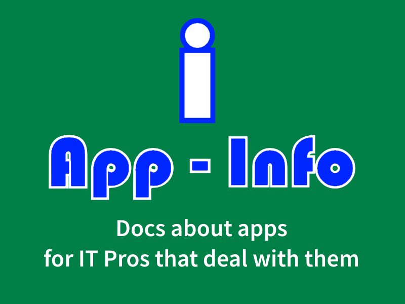

# App-Info
A community sourced information repository with documentation about applications for IT Professional Desktop Engineers.

This repository is a community-based documentation store for information about applications.  The intended audience of this documentation is for IT Professionals that prepare, deploy, test, and debug applications that they get from vendors.  The goal is to share common information that will be useful to perform those tasks.

As a community project, we do not expect (but will welcome) involvement of the vendors that produce these applications.  Although some of the information on this repository might not be in alignment with the marketing or other goals of the vendor, code-of-conduct rules exist that contributors must agree to.  We want to be positive!

This community project welcomes all contributors. 
* By participating you are agreeing to our [Code of Conduct](CODE_OF_CONDUCT.md).
* To add a new application, or edit existing ones, see instructions here: [Template](/Templates).
* The `Issues` feature of GitHub should ONLY be used in this repository if you plan to submit a pull request to fix the issue.
* Please use the `Disuccsions` area (rather than issues) to dicuss topics like:
> * I'd like to see information on this app (but I'm too lazy to add it in myself).
> * I'd like to know how to do X on this app.
> * This looks wrong, and why it looks wrong and what it should look like.
* Items that start as `Discussions` can get pulled into `Issues` when a contributer decides to take it on.

## App-Info Areas
The site is currently divided into two areas:
* Information on common repackaging tool filtering.
* Application Specific Information.

## The Capture Filters List

The [CaptureFilters](docs/CaptureFilters) area of this documentation site provides a place for us to gather information on things to filter out / clean out when repackaging applications.

## The Applications List

 

Click the button above (or type the letter 't') to enable folder/file search.  Just enter the name of the app you want!

Currently we have documentation on the following Windows based apps:

| | Application | Vendor |
|----|----|----|
|  | [7-Zip](docs/Windows/7-Zip) | 7-Zip |
|  | [ACE](docs/Windows/VirtualEngine/Ace) | Virtual Engine |
|  | [AppV_Manage](docs/Windows/TMurgent/AppV_Manage) | TMurgent Technologies, LLP |
|  | [AppV Manifest Editor (AVME)](docs/Windows/TMurgent/AppVManifestEditor) | TMurgent Technologies, LLP |
| | [Active Python](docs/Windows/Active%20State//ActivePython) | Active State |
|  | [Adobe Reader DC](docs/Windows/Adobe/AdobeReader%20DC) | Adobe Systems |
| | [Anaconda](docs/Windows/ContinuumAnalytics/Anaconda) | Continuum Analytics |
|  | [Audacity](docs/Windows/Audacity) | Audacity |
|  | [Avogadro](docs/Windows/Avogadro) | Avogadro |
|  | [BeeKeeper Studio](docs/Windows/BeekeeperStudio) | BeeKeeperStudio.io |
|  | [Blender](docs/Windows/Blender) | Blender Foundation |
|  | [Calibre](docs/Windows/Calibre) | Calibre |
|  | [Camtasia](docs/Windows/Techsmith/Camtasia) | Techsmith |
|  | [ConEmuPack](docs/Windows/ConEmu/ConEmuPack) | Conemu.gethub.io |
|  | [CyberDuck](docs/Windows/CyberDuck) | Cyberduck.io |
|  | [DosBox & 16-bit App](docs/Windows/DosBox_Blockout) | DosBox and California Dreams |
|  | [DraftSight](docs/Windows/Solidworks/DraftSight) | Solidworks (Dassault) |
| | [Ensoft APile](docs/Windows/Ensoft/APile) | Ensoft |
| | [Ensoft LPile](docs/Windows/Ensoft/LPile) | Ensoft |
|  | [Ensoft Shaft](docs/Windows/Ensoft/Shaft) | Ensoft |
|  | [ExamDiff](docs/Windows/PrestoSoft/ExamDiff) | PrestoSoft |
|  | [Fiddler (Classic)](docs/Windows/Telerik/Fiddler) | Telerik |
|  | [Filezilla](docs/Windows/Filezilla) | Filezilla.org |
|  | [Firefox](docs/Windows/Mozilla/Firefox) | Mozilla.org |
|  | [Foxit Reader](docs/Windows/Foxit%20Software/Foxit%20Reader) | Foxit Software |
|  | [Gimp](docs/Windows/Gimp) | Gimp |
|  | [ImageGlass Kobe](docs/Windows/ImageGlass.org/ImageGlass%20Kobe) | ImageGlass.org |
|  | [InstEd](docs/Windows/Camwood/InstEd) | Camwood Studios |
|  | [IrfanView](docs/Windows/IrfanView) | IrfanView (Irfan Skiljan ) |
|  | [Libre Office](docs/Windows/LibreOffice) | LibreOffice.org |
|  | [Login ACDC (v2)](docs/Windows/LoginConsultants/ACDC%20v2) | Login Consultants |
|  | [Math Mechanixs](docs/Windows/MathMechanixs) | MathMechanixs |
|  | [Microsoft SSMS](docs/Windows/Microsoft/SSMS) | Microsoft |
|  | [MikTex](docs/Windows/MikTex) | MikTex.org |
|  | [Mozilla Thunderbird](docs/Windows/Mozilla/Thunderbird) | Mozilla Foundation |
|  | [mRemoteNG](docs/Windows/mRemoteNG) | RemoteNG.org |
|  | [Notepad++ Main app](docs/Windows/Notepad++/MainApp) | Notepad++ |
|  | [Notepad++ PlugIn](docs/Windows/Notepad++/Plugin-Compare) | Notepad++ |
|  | [OBS Studio](docs/Windows/ObsStudio) | ObsProject.com |
|  | [Opera](docs/Windows/Opera) | Opera |
|  | [Paint.Net Main app](docs/Windows/Paint.Net/Paint.Net%20MainApp) | Paint.Net |
|  | [Paint.Net PlugIn](docs/Windows/Paint.Net/Paint.Net%20Plugins) | Paint.Net |
|  | [Password Depot](docs/Windows/PasswordDepot) | AceBit |
|  | [Postman](docs/Windows/Postman) | Postman |
|  | [Power BI Desktop](docs/Windows/Microsoft/PowerBIDesktop) | Microsoft |
|  | [Project Libre](docs/Windows/ProjectLibre) | Project Libre |
|  | [R (Language)](docs/Windows/R/R%20Language) | Washington Univ of St Louis |
|  | [R And RStudio](docs/Windows/R/R%20with%20RStudio) | RStudio |
|  | [RegShot](docs/Windows/Seabreg/RegShot) | Seabreg |
|  | [ReverseDNS](docs/Windows/ReverseDNS) | Unknown |
|  | [Remote Desktop Manager Free](docs/Windows/Devolutions/RemoteDesktopManager%20Free) | Devolutions |
|  | [Siemens JT2Go](docs/Windows/Siemens/JT2Go) | Siemens |
|  | [Sigil](docs/Windows/Sigil) | Sigil |
|  | [SnagIt](docs/Windows/Techsmith/Snagit) | Techsmith |
|  | [SolibriOffice](docs/Windows/Solibri/SolibriOffice) | Solibri |
|  | [TeamViewer](docs/Windows/TeamViewer) | TeamViewer |
|  | [ThumbIco](docs/Windows/Aurelitec/Thumico) | Aurelitec |

